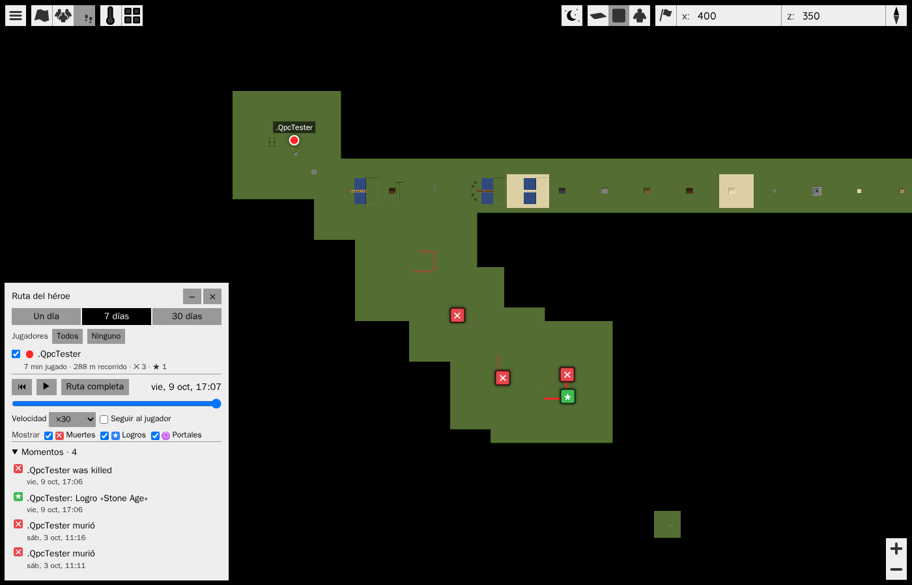
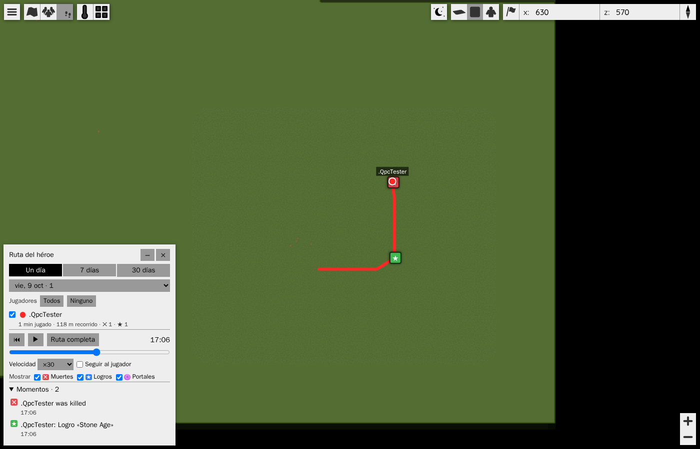
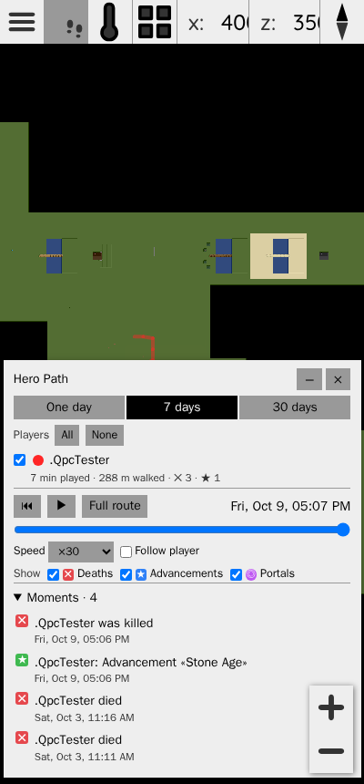
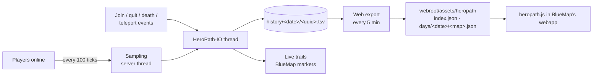

<p align="center">
  
</p>

# HeroPath

**Where every player went, on the BlueMap web map.** A Paper plugin that records each
player's route and lets you replay any day with a time slider, like the Hero's Path in
*Zelda: Breath of the Wild*.


| Read | For |
|---|---|
| [Quick start](#quick-start) | Build, install, the two commands |
| [How it works](#how-it-works) | The pieces and the file format |
| [Configuration](#configuration) | Every setting in `config.yml` |
| [`src/main/resources/web/heropath.js`](src/main/resources/web/heropath.js) | The web panel |

## What it is

[BMTrails](https://github.com/Mark-225/BMTrails) (Mark-225) draws the last minute of each
player's movement as a line on BlueMap and then forgets it. HeroPath keeps that **live
trail** and adds the part BMTrails never had: **history**. Every few seconds it writes
down where each player is, files it per day, and publishes it next to BlueMap's own web
files. A **footprints button** on the map opens a panel:

- **One day, the last 7 days or the last 30 days.** Short sessions add up into one route.
- **Complete routes first**, older parts fainter; the time bar then replays them. It
  **skips the hours nobody was playing**, so a week plays as one story. Speeds from ×1 to
  ×1200, a jump to the start and one to the full route.
- **Moments on the route:** ✕ where a player died, with the game's own death message;
  ★ for each advancement (green task, blue goal, purple challenge); ◎ where they arrived
  from another dimension. The panel lists them; clicking one jumps there.
- **Per player:** time played, distance walked, deaths and advancements. Click a name to
  see only that player and fly the camera to their route.

Teleports, portals and deaths break the line, so it never crosses ground nobody walked.

It was written for the Multitec server (Paper 26.2, BlueMap served as static files behind
a login), so it needs **no web server of its own**: everything is plain JSON in BlueMap's
webroot, and works wherever BlueMap's webapp is served from.

## Quick start

```bash
# build (needs Docker; Paper 26.2's API requires Java 25, so the build runs in Gradle 9 / JDK 25)
docker run --rm -u "$(id -u):$(id -g)" -e GRADLE_USER_HOME=/gradle -v gradle-cache:/gradle \
  -v "$PWD":/w -w /w gradle:9.1.0-jdk25 gradle --no-daemon -q build
# -> build/libs/heropath-2.1.0.jar   (also runs the 20 unit tests)

cp build/libs/heropath-2.1.0.jar <server>/plugins/    # BlueMap must be installed; restart the server
```

```text
/heropath status    # BlueMap found? which maps? days on disk, last web export
/heropath export    # rewrite the web files now instead of waiting for the next 5-minute pass
```

## Gallery

| A week of routes | Replay, half-way through a day |
|---|---|
|  |  |
| Two days of routes at once: the older one is fainter. | The slider stops the route at that moment. |

<p align="center">
  
</p>

The panel speaks Spanish or English, following the browser. The screenshots come from a
throwaway test world, walked by a scripted Bedrock client (`tools/bedrock-walker`).

## How it works



| Piece | What it does |
|---|---|
| `Recorder` | Keeps a position only if the player moved ≥ 2 blocks, or a minute passed. A move > 64 blocks, or into another world, is a **jump** |
| `HistoryStore` | Append-only text, one file per player per local day: `epochMillis kind world x y z [detail]` (`P` point, `J` join, `Q` quit, `D` death, `T` jump, `A` advancement, `W` arrived from another dimension). Only events carry the 7th column (the death message, `frame\|title`, the dimension left). A torn last line is skipped; 2.0 files still read |
| `DayExport` | One JSON per BlueMap map per day; times are seconds since local midnight, and `t0` is that midnight, so the panel joins days into one timeline |
| `WebExporter` | Writes atomically (temp file + move), keeps only the last `web.days`, rebuilds after a restart |
| `heropath.js` | Draws with BlueMap's own `LineMarker` / `HtmlMarker`, in a group of its own so BlueMap's marker refresh never wipes it |

## Configuration

`plugins/HeroPath/config.yml`, all optional:

| Key | Default | Meaning |
|---|---|---|
| `timezone` | `Europe/Madrid` | Which local day a sample belongs to, and the clock the slider shows |
| `history.samplingTicks` | `100` | How often positions are read (20 ticks = 1 s) |
| `history.minMoveBlocks` | `2.0` | Standing still writes nothing… |
| `history.keepAliveSeconds` | `60` | …except once a minute |
| `history.jumpDistance` | `64.0` | Longer than this between two samples was not walked |
| `history.keepDays` | `0` | Delete history older than this; `0` keeps it forever |
| `web.days` | `30` | Days published to the map |
| `web.exportSeconds` | `300` | How often the web files are rewritten |
| `live.*` | on, 36 points | The BMTrails live trail: points, width, layer name, visible by default |

<details>
<summary>Privacy and who is recorded</summary>

- A player hidden from BlueMap (BlueMap's own visibility setting) is neither recorded nor
  drawn.
- Permission `heropath.untracked` excludes a player entirely.
- The history is kept on the server's disk; only the last `web.days` days are published,
  and only to wherever BlueMap's webapp is served. Put that behind a login if routes should
  not be public: a route shows where someone lives.

</details>

<details>
<summary>Known limits</summary>

- On the two days a year the clock changes, the slider shows elapsed time since midnight,
  so it reads one hour off after the change.
- Only positions taken while the plugin runs are recorded; there is no history from before
  it was installed.
- The live trail is a BlueMap marker, so it is only as fresh as BlueMap's marker write
  interval (`write-markers-interval`).

</details>

## Credits

Fork of [Mark-225/BMTrails](https://github.com/Mark-225/BMTrails) (MIT). The live trail is
BMTrails' idea and largely its logic; the history, export and web panel are new.
Maintained by [Multitec-UA](https://github.com/Multitec-UA). MIT licence, see
[LICENSE](LICENSE).
